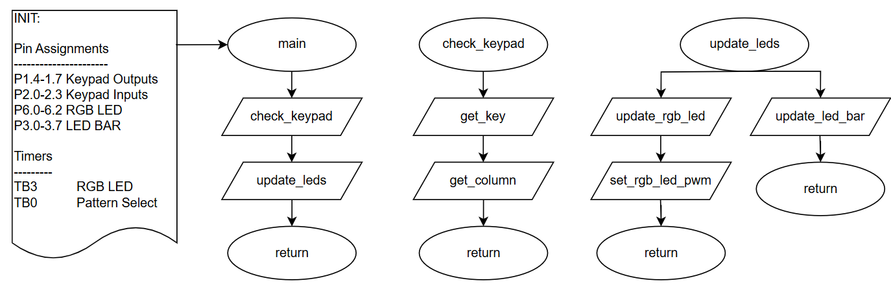
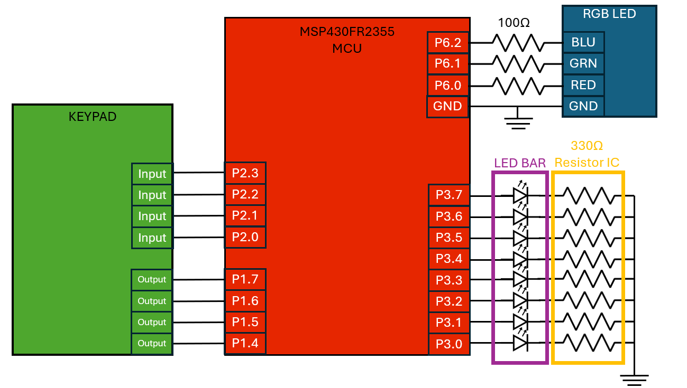
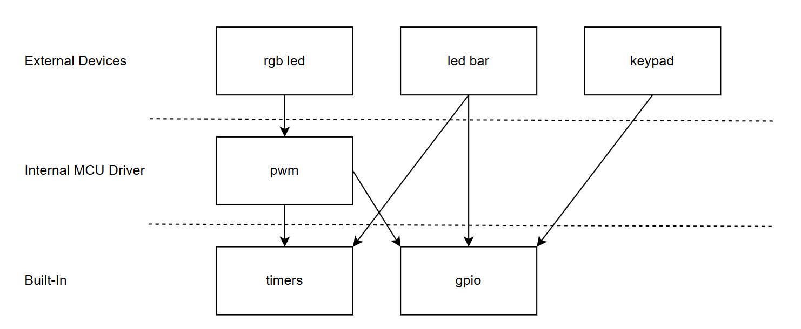

# Project 3 - Demo

## Team Members
Jay Graham, Kyle Stopplecamp

## Introduction
This project involves using an MSP430 microcontroller to interface with a 16-button keypad, an LED bar, and an RGB LED to create a user-controlled LED pattern display. The system requires users to enter a four-digit unlock code via the keypad to access and select LED patterns, with an RGB LED serving as a status indicator. 

### High-Level Flowcharts

### Circuit Diagram

### Software Architecture

## DEMO
Done with TA on 2/25/25

## Review of Results
| Workload                                                          | Total |    Jay    |    Kyle   |
|-------------------------------------------------------------------|-------|-----------|-----------|
|Introduction                                                       | 1     |     1     |     0     |
|Circuit diagram                                                    | 1     |     0     |     1     |
|Main loop flowchart                                                | 1     |     0     |     1     |
|System architecture diagram                                        | 1     |     1     |     0     |
|Professional demo                                                  | 2     |     1     |     1     |
|System starts in a locked state                                    | 0.5   |    0.5    |     0     |
|Unlock code works and is 4-digits long                             | 4     |     0     |     4     |
|LED is set to correct color when locked                            | 0.5   |    0.5    |     0     |
|LED is set to correct color when being unlocked                    | 0.5   |    0.5    |     0     |
|LED is set to correct color when unlocked                          | 0.5   |    0.5    |     0     |
|Extra credit: LED is set to a unique color for each LED pattern    | 0     |     -     |     -     |
|When the system is locked, all LEDs are off                        | 0.5   |    0.5    |     0     |
|When LEDs are off until a user selects a pattern                   | 0.5   |    0.5    |     0     |
|When the selected pattern is the same, the pattern restarts        | 0.5   |    0.5    |     0     |
|When a new pattern is selected, the pattern must start within 1 s  | 2     |     1     |     1     |
|Previously selected pattern starts where it left off               | 0.5   |    0.5    |     0     |
|LED pattern transition period is changeable                        | 2     |     0     |     2     |
|LED pattern 0                                                      | 0.5   |    0.5    |     0     |
|LED pattern 1                                                      | 0.5   |    0.5    |     0     |
|LED pattern 2                                                      | 0.5   |    0.5    |     0     |
|LED pattern 3                                                      | 0.5   |    0.5    |     0     |
|                                                                   | 20    |    10     |    10     |
